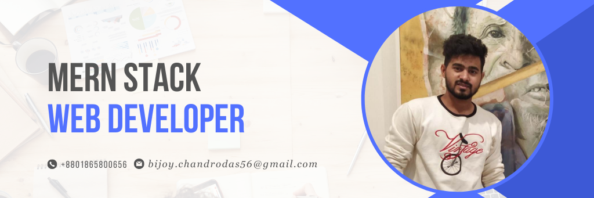

<h1 align="center">Hi 👋, I'm Bijoy Chandro Das</h1>
<h3 align="center">A passionate Software developer from Bangladesh</h3>

I am a Passionate and Results-oriented Software Engineer. I pursued a Bachelor's in Computer Science and Engineering from Stamford University Bangladesh. I have working with rest API , Node JS, Express JS JavaScript and React JS . I am constantly striving to learn new technologies and look for ways to better myself in this rapidly changing industry.

- 🌍 I’m working at **Tiggzy IT as a Jr. Web Developer**
* ✉️  You can contact me at [bijoy.chandrodas56@gmail.com](mailto:bijoy.chandrodas56@gmail.com)
* 🧠  I'm learning Spring Boot, Postgresql, AWS 

  

<h3 align="left">Connect with me:</h3>

<h3 align="left">🏆 GitHub Trophies:</h3>

  

<h3 align="left">Languages and Tools:</h3>

               

&nbsp;

